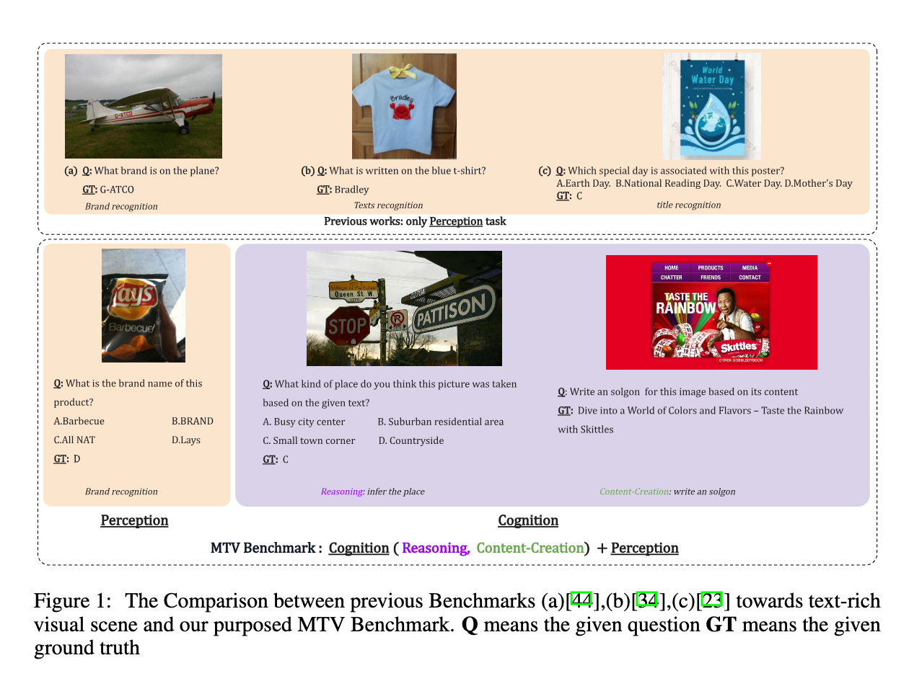
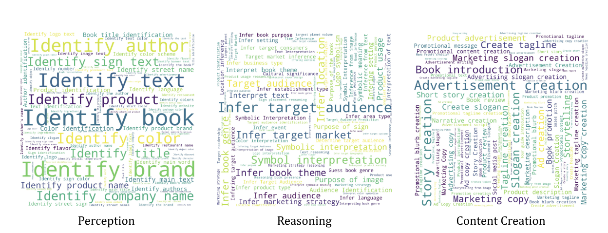

# MCTBench

MCTBench: Multimodal Cognition towards Text-Rich Visual Scenes Benchmark




We introduce a multimodal benchmark towards text-rich visual scenes designed to evaluate the cognitive capabilities of MLLMs via conducting visual reasoning and content-creation tasks. To mitigate potential evaluation bias from the varying distributions of datasets,  MTV incorporates several perception tasks (e.g., scene text recognition) to provide a consistent comparison of both the cognitive and perceptual capabilities of MLLMs.


## Data Distribition


MTV comprises 5.3k text-rich images and 8.5k rigorously annotated question-answer pairs divided into three types of tasks: perception, reasoning and content-creation.

<!-- ## Leaderboard -->

## Data Download

[RawData (Google Drive)](https://drive.google.com/drive/folders/12-klr5vjGBzwTd10YLKIpzw0X5elDPSG?usp=drive_link)

<!-- 
## Direct Use
The data is designed to evaluate and enhance the multilingual textual vqa capabilities of multimodal models in the hope of facilitating the understanding of multilingual images, enabling AI to reach more people in the world.

## Out-of-Scope Use
Academic use only, not supported for commercial use -->

## Dataset Structure

### Data Instances

```python
{
        "id": 0, 
        "img": "014312224X.jpg", 
        "category": "perception", 
        "question": "What is the title of the book in the image?", 
        "choice": ["A. Your Medical Guide", "B. Your Medical Path", "C. Your Medical Mind", "D. Your Medical Journey"], 
        "answer": "C"
}
{
        "id": 2734, 
        "img": "19974.png", 
        "category": "reasoning", 
        "question": "Why does the slide emphasize the role of creation in an advertising medium's visibility?", 
        "choice": ["A. Because creation determines the medium's quality", "B. Because the medium is created by a person", "C. Because creation is the initial step in the advertising process", "D. Because creation has the highest share in advertising"], 
        "answer": "D"
}
{
        "id": 5336,
        "img": "175153.png", 
        "category": "content creation", 
        "question": "Create a marketing statement for the VICHY DERMABLEND product based on the image.", 
        "choice": [], 
        "answer": "Discover your true beauty with VICHY DERMABLEND, the skincare solution that effortlessly evens out your skin tone, letting your natural glow shine through."
}
```


### Data Fields

The dataset comprises the following fields:
- `id`: a unique number for each question-answer pair
- `img`: a path to image
- `category`: a string to identify the task type of question-answer pairs
- `question`: a string containing the question to be answered
- `choice`: a list of strings containing the possible answers to the question (not supplied for creation task)
- `answer`: a string containing the answer to the corresponding question


## Disclaimer

Your access to and use of this dataset are at your own risk. We do not guarantee the accuracy of this dataset. The dataset is provided “as is” and we make no warranty or representation to you with respect to it and we expressly disclaim, and hereby expressly waive, all warranties, express, implied, statutory or otherwise. This includes, without limitation, warranties of quality, performance, merchantability or fitness for a particular purpose, non-infringement, absence of latent or other defects, accuracy, or the presence or absence of errors, whether or not known or discoverable. In no event will we be liable to you on any legal theory (including, without limitation, negligence) or otherwise for any direct, special, indirect, incidental, consequential, punitive, exemplary, or other losses, costs, expenses, or damages arising out of this public license or use of the licensed material. The disclaimer of warranties and limitation of liability provided above shall be interpreted in a manner that, to the extent possible, most closely approximates an absolute disclaimer and waiver of all liability.

## License
[CC BY-NC 4.0](https://creativecommons.org/licenses/by-nc/4.0/)
